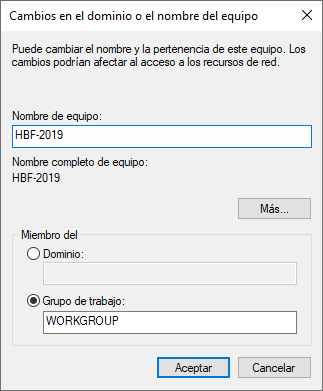
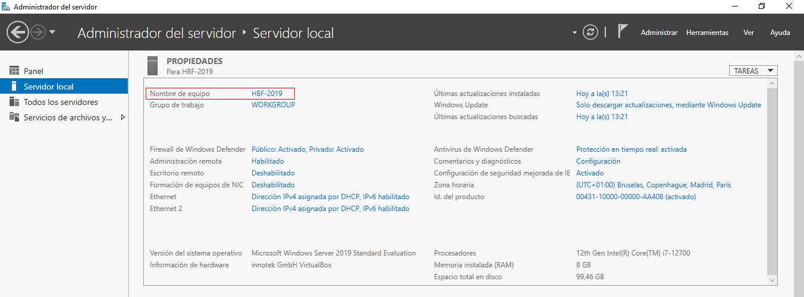
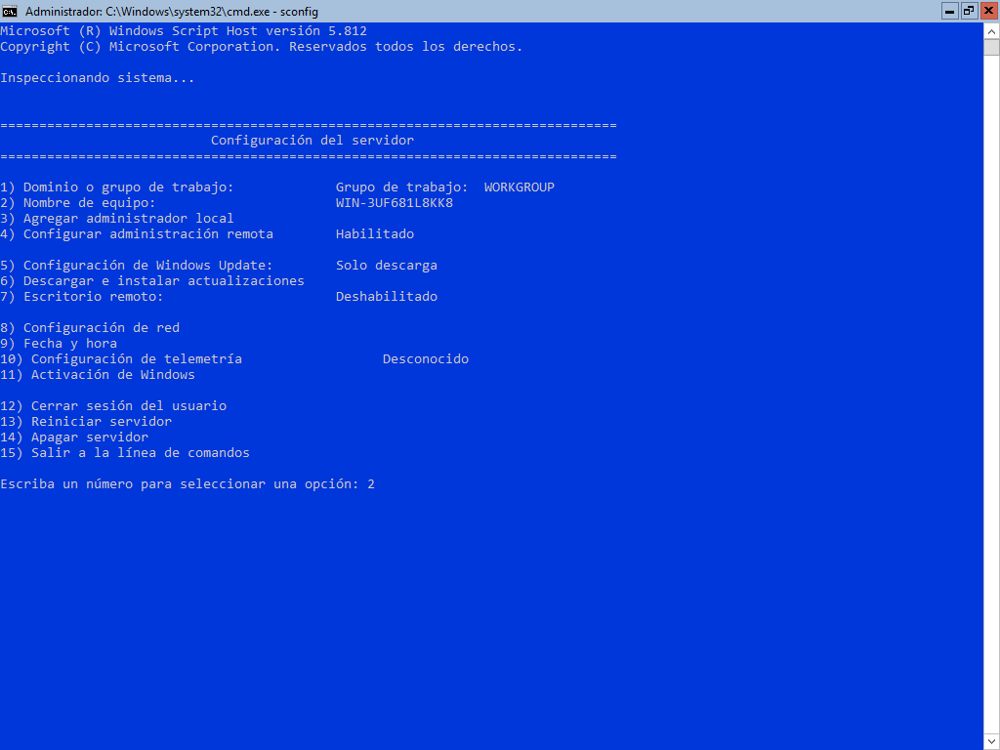
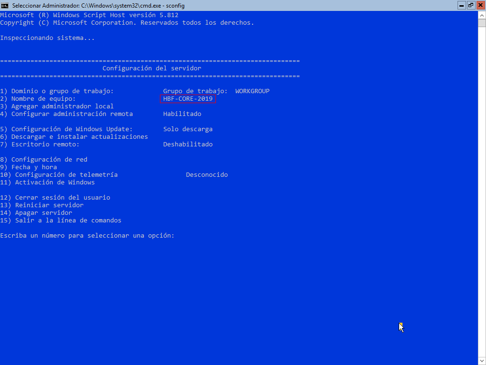
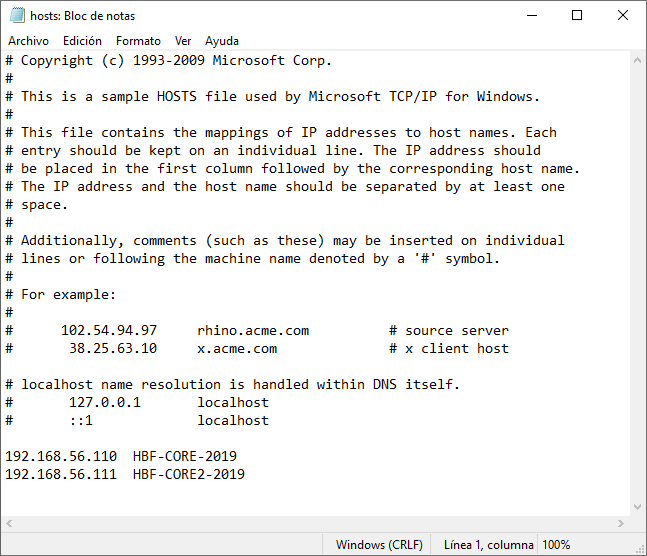
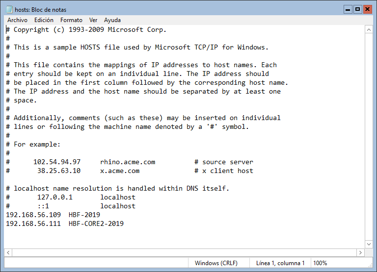
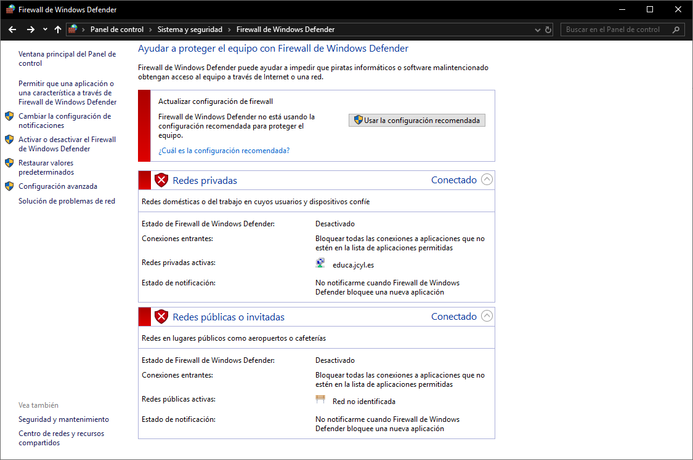
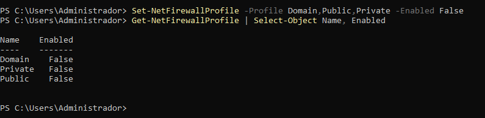

# PR0201: Administración remota con Powershell

## 1. Entorno virtualizado

Tendremos que tener instaladas tres máquinas virtuales en VirtualBox de Windows Server 2019 en la que tienen que tener los siguientes hostname o nombre del equipo:
- Windows Server 2019 con entorno gráfico: `HBF-2019`
- Windows Server 2019 en modo core: `HBF-CORE-2019`
- Segundo Windows Server 2019 en modo core: `HBF-CORE2-2019`

Tienen que tener además, un adaptador de red en solo-anfitrión.

## 2. Preparación de las máquinas

### 2.1. Cambiar hostname en Windows Server 2019 con entorno gráfico 
- Dentro de la ventana del administrador del servidor clicamos en **Servidor local**.
- En **Propiedades**, clicamos en el nombre del equipo que aparece en azul.
- Se abre Propiedades del sistema, clicamos en **Cambiar** y ahí cambiamos el nombre del equipo.



- Aceptamos y reiniciamos el servidor. Luego, volvemos al mismo apartado y veremos que se ha cambiado el nombre del equipo.



### 2.2. Cambiar hostname en Windows Server 2019 Core
- Pondremos el comando `sconfig` y la terminal se cambiará a color azul y tendremos un menú con varias opciones. Seleccionamos la opción 2.



- Pulsamos Enter, ponemos el nombre destinado al equipo y reiniciamos el equipo. Después de reiniciar, volvemos a escribir `sconfig` y veremos que se ha cambiado el nombre en la opción 2.



### 2.3. Editar archivo hosts
En Windows Server con entorno gráfico, abrimos el **Explorador de archivos** y nos iremos al siguiente directorio:
```powershell
C:\Windows\System32\drivers\etc
```

Y el archivo que se llama `hosts` lo editamos en el **Bloc de notas**. Ahí pondremos las direcciones IP de los dos servidores Core con su hostname como vienen en la captura.




En Windows Server Core, tendremos que ir a la misma dirección, pero como no tenemos el Explorador de archivos, tenemos que poner el siguiente comando:
```powershell
notepad C:\Windows\System32\drivers\etc\hosts
```

Pondremos la IP de un servidor Core y del servidor con entorno gráfico.



Repetiremos el mismo proceso en el otro servidor Core.

Una vez guardados los cambios en los tres servidores, comprobamos que se hagan ping entre ellas.
- HBF-2019


- HBF-CORE-2019


- HBF-CORE2-2019


### 2.4. Deshabilitar el Firewall
En nuestra maquina de Windows Server con entorno gráfico, basta con ir hacia el `Panel de control > Sistema y seguridad > Firewall de Windows Defender`, clicamos en `Activar o desactivar el Firewall de Windows Defender` y seleccionamos la opción `Desactivar Firewall de Windows Defender (no recomendado)` en todas las redes que tengamos del servidor.



Para la máquina de Windows Server Core tendremos que poner el siguiente comando:
```powershell
Set-NetFirewallProfile -Profile Domain,Public,Private -Enabled False
```

Y para comprobar que se haya deshabilitado, pondremos el siguiente comando:
```powershell
Get-NetFirewallProfile | Select-Object Name, Enabled
```



## 3. Configuración del acceso remoto al nuevo equipo
Desde Windows Server con entorno gráfico, crearemos un usuario con los permisos de administrador en el que se llamará `admin_hbf`. Para crearlo lo haremos desde **PowerShell como administrador**.  
Pondremos la lista de los siguientes comandos:
```powershell
$Password = Read-Host –AsSecureString
```

Este comando lo que hace es asignar una contraseña segura. Le ponemos una contraseña en la que tenga mayúsculas, números y que sea mayor de 8 carácteres.

```powershell
 New-LocalUser "admin_hbf" –Password $Password –FullName “admin_hbf” –Description “Usuario administrador”
```

Aquí, pondremos primero el nombre que veremos, después aplicará la contraseña que hemos añadido en el comando anterior. Después, pondremos el nombre completo de la cuenta, yo usaré el mismo nombre, y por último la descripción del usuario.  
Veremos la información de la cuenta en formato tabla después de pulsar Enter.

Ahora, añadiremos el usuario creado al grupo de administradores del equipo con el siguiente comando:
```powershell
Add-LocalGroupMember –Group “Administradores” Member “admin_hbf”
```

Si no ha dado error, podremos salir de Powershell.


## 4. Configuración del acceso remoto sobre HTTPS


## 5. Configuración remota con Windows Admin Center


[Volver a UT02](../index.md)