# PR0201: Administración remota con Powershell

## 1. Entorno virtualizado

Tendremos que tener instaladas tres máquinas virtuales en VirtualBox de Windows Server 2019 en la que tienen que tener los siguientes hostname o nombre del equipo:
- Windows Server 2019 con entorno gráfico: `HBF-2019`
- Windows Server 2019 en modo core: `HBF-CORE-2019`
- Segundo Windows Server 2019 en modo core: `HBF-CORE2-2019`

Tienen que tener además, un adaptador de red en solo-anfitrión y sus IP serán las siguientes:
- HBF-2019: `192.168.56.10`
- HBF-CORE-2019: `192.168.56.11`
- HBF-CORE2-2019: `192.168.56.12`

Las tres máquinas tendrán también un adaptador secundario en NAT para la salida a Internet.

## 2. Preparación de las máquinas

### Cambiar hostname y poner IP estática en Windows Server 2019 con entorno gráfico 
- Dentro de la ventana del administrador del servidor clicamos en **Servidor local**.
- En **Propiedades**, clicamos en el nombre del equipo que aparece en azul.
- Se abre Propiedades del sistema, clicamos en **Cambiar** y ahí cambiamos el nombre del equipo.

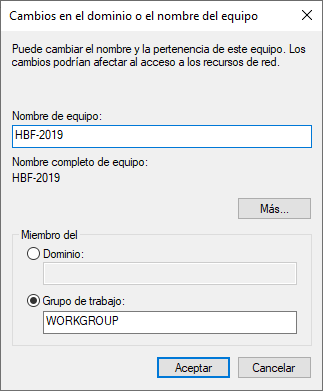

- Aceptamos y reiniciamos el servidor. Luego, volvemos al mismo apartado y veremos que se ha cambiado el nombre del equipo.

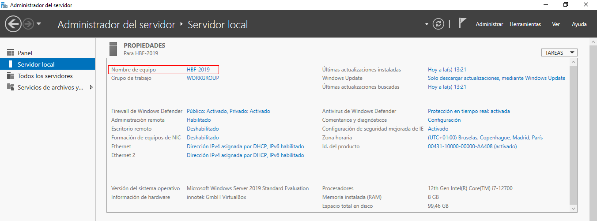

Para ponerle una IP estática, pulsaremos `Win+R` y escribimos `ncpa.cpl`. Dentro del apartado de red, iremos al adaptador que queremos cambiar, en este caso será el que tiene la red en **solo anfitrión** y no la **NAT** que es la que tiene salida a Internet.  
Hacemos clic derecho y vamos a `Propiedades > Protocolo de Internet versión 4 (TCP/IPv4)`. Le pondremos la IP `192.168.56.10` y la máscara de subred la `255.255.255.0`.  
Guardamos los cambios y reiniciamos el adaptador de red haciendo clic derecho en `Desactivar` y `Activar` y luego nos iremos a la terminal y pondremos el comando `ipconfig` y veremos el adaptador de red con la IP que hemos puesto.

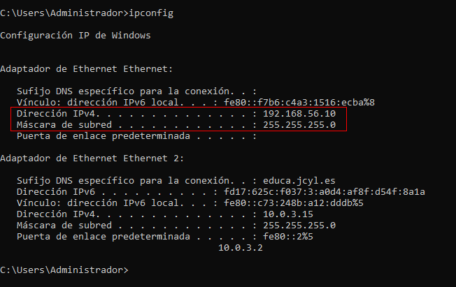

### Cambiar hostname y poner IP estática en Windows Server 2019 Core
En este caso, utilizaré la máquina HBF-CORE-2019 para realizar las capturas. Repetiremos los mismos pasos para el otro servidor.
- Pondremos el comando `sconfig` y la terminal se cambiará a color azul y tendremos un menú con varias opciones. Seleccionamos la opción 2.

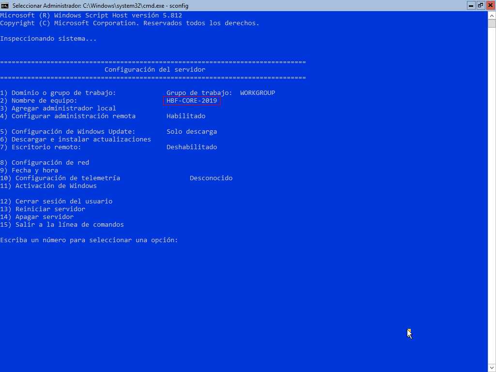

- Pulsamos Enter, ponemos el nombre destinado al equipo y reiniciamos el equipo. Después de reiniciar, volvemos a escribir `sconfig` y veremos que se ha cambiado el nombre en la opción `2`.

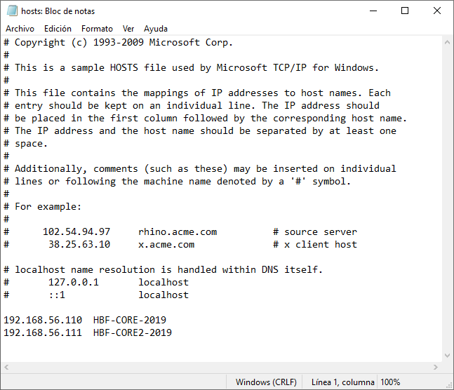

Para poner una IP estática, volvemos a escribir `sconfig` y seleccionamos la opción `8`. Seleccionamos la opción `1` que será la que modificaremos porque la `2` es la red **NAT** que da salida a Internet. Volvemos a seleccionar la opción `1` para cambiar la IP. Seleccionamos `e` para poner la IP estática, que en este caso será la `192.168.56.11`, dejamos en blanco la máscara de red, que será la `255.255.255.0` y pulsamos **Enter**.

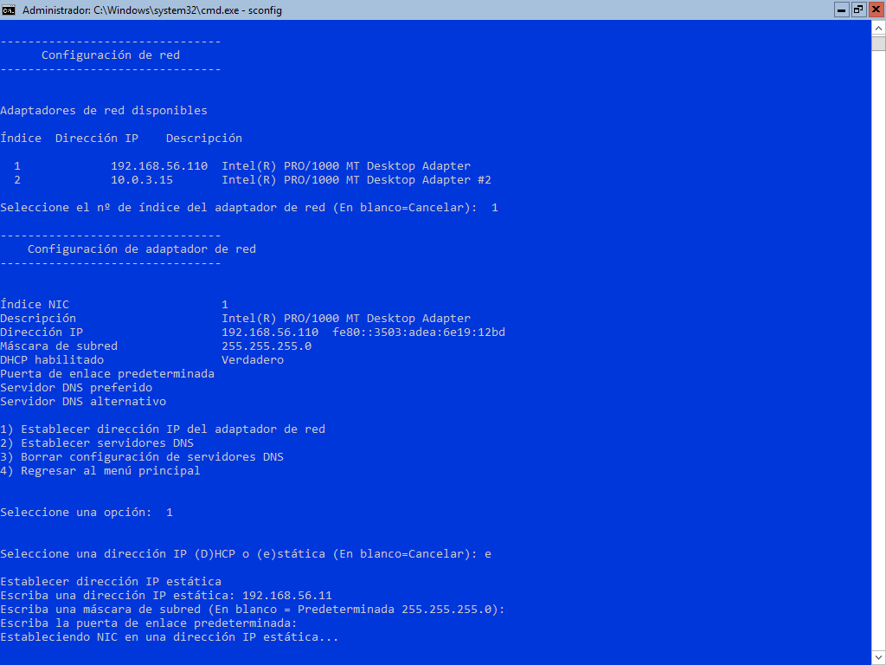

Salimos con la opción `4` para salir de la configuración de red y la opción `15` para salir de **sconfig**.  
Ponemos el comando `ipconfig` y veremos que se habrá cambiado la IP.

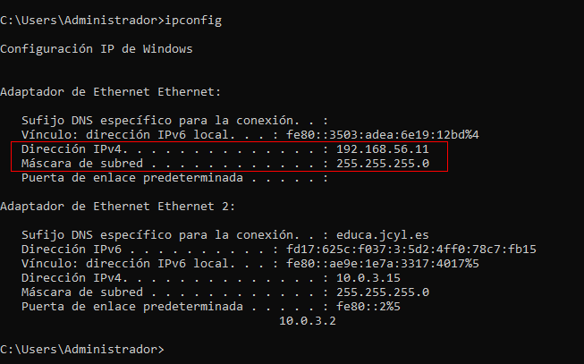

### Editar archivo hosts
En Windows Server con entorno gráfico, abrimos el **Explorador de archivos** y nos iremos al siguiente directorio:
```powershell
C:\Windows\System32\drivers\etc
```

Y el archivo que se llama `hosts` lo editamos en el **Bloc de notas**. Ahí pondremos las direcciones IP de los dos servidores Core con su hostname como vienen en la captura.


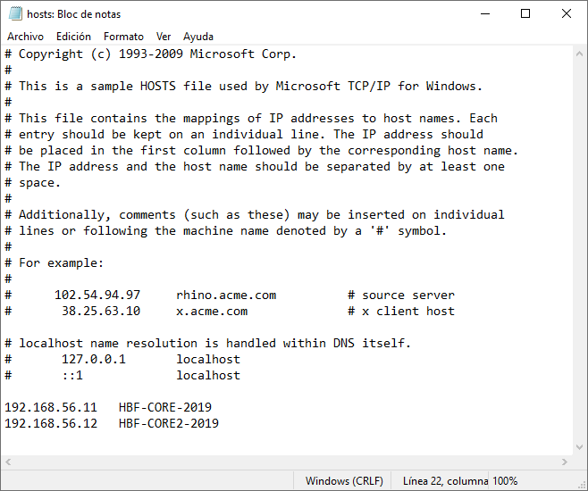

En Windows Server Core, tendremos que ir a la misma dirección, pero como no tenemos el Explorador de archivos, tenemos que poner el siguiente comando:
```powershell
notepad C:\Windows\System32\drivers\etc\hosts
```

Pondremos la IP de un servidor Core y del servidor con entorno gráfico.

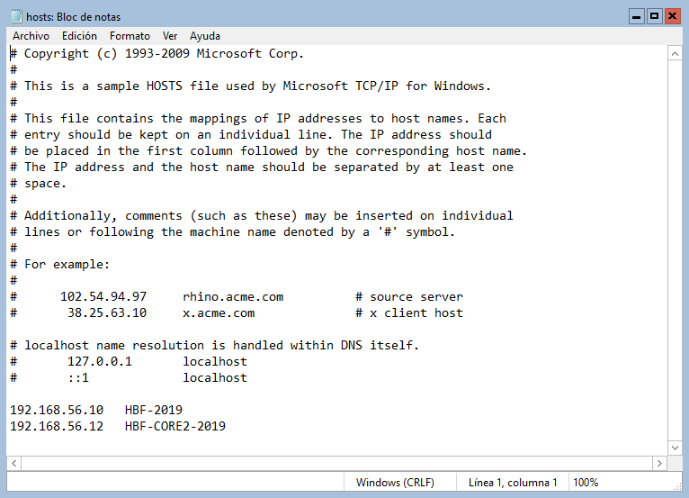

Repetiremos el mismo proceso en el otro servidor Core.

Una vez guardados los cambios en los tres servidores, comprobamos que se hagan ping entre ellas.
- HBF-2019

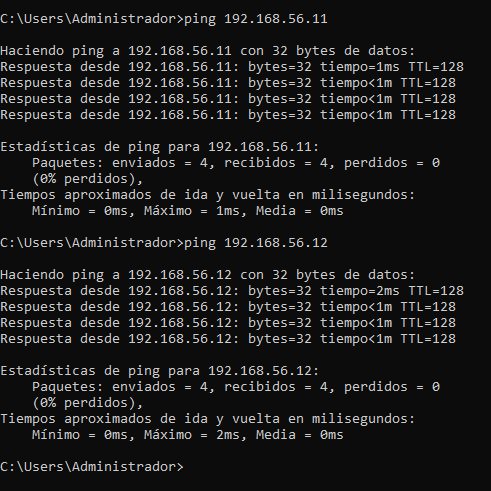

- HBF-CORE-2019

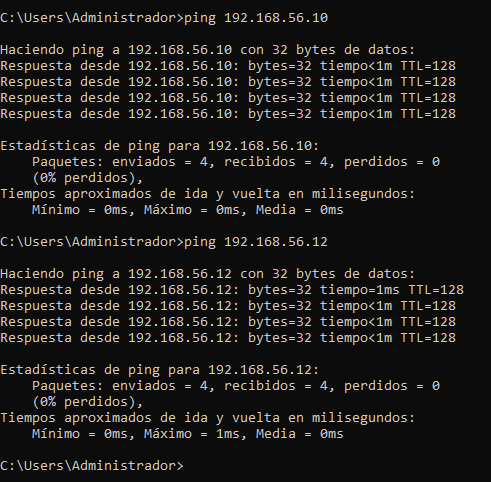

- HBF-CORE2-2019

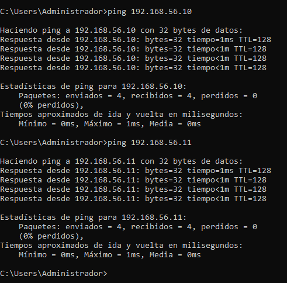

### Deshabilitar el Firewall
En nuestra maquina de Windows Server con entorno gráfico, basta con ir hacia el `Panel de control > Sistema y seguridad > Firewall de Windows Defender`, clicamos en `Activar o desactivar el Firewall de Windows Defender` y seleccionamos la opción `Desactivar Firewall de Windows Defender (no recomendado)` en todas las redes que tengamos del servidor.

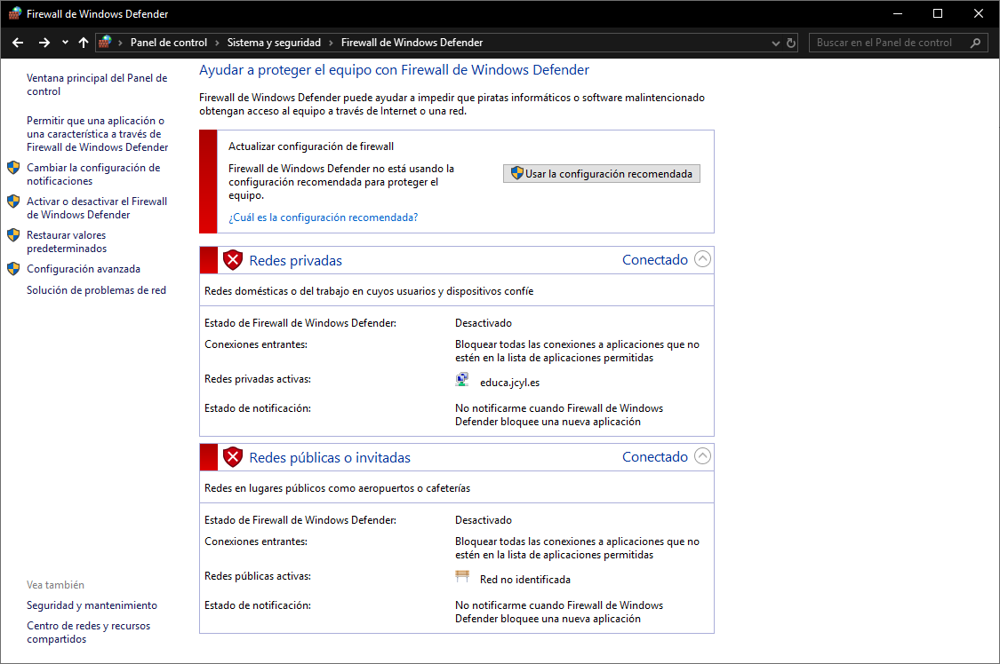

Para la máquina de Windows Server Core tendremos que poner el siguiente comando:
```powershell
Set-NetFirewallProfile -Profile Domain,Public,Private -Enabled False
```

Y para comprobar que se haya deshabilitado, pondremos el siguiente comando:
```powershell
Get-NetFirewallProfile | Select-Object Name, Enabled
```

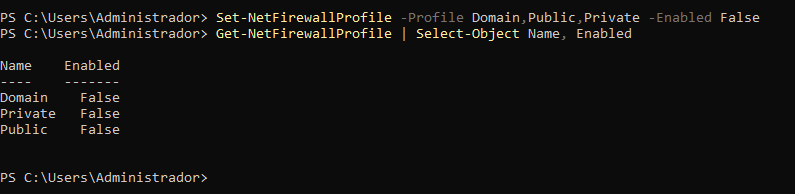

Repetimos lo mismo en el otro servidor **CORE**.

## 3. Configuración del acceso remoto al nuevo equipo
Desde Windows Server con entorno gráfico, crearemos un usuario con los permisos de administrador en el que se llamará `admin_hbf`. Para crearlo lo haremos desde **PowerShell como administrador**.  
Pondremos la lista de los siguientes comandos:
```powershell
$Password = Read-Host –AsSecureString
```

Este comando lo que hace es asignar una contraseña segura. Le ponemos una contraseña en la que tenga mayúsculas, números y que sea mayor de 8 carácteres.

```powershell
 New-LocalUser "admin_hbf" –Password $Password –FullName “admin_hbf” –Description “Usuario administrador”
```

Aquí, pondremos primero el nombre que veremos, después aplicará la contraseña que hemos añadido en el comando anterior. Después, pondremos el nombre completo de la cuenta, yo usaré el mismo nombre, y por último la descripción del usuario.  
Veremos la información de la cuenta en formato tabla después de pulsar Enter.

Ahora, añadiremos el usuario creado al grupo de administradores del equipo con el siguiente comando:
```powershell
Add-LocalGroupMember –Group “Administradores” -Member “admin_hbf”
```

Si no ha dado error, podremos salir de Powershell.

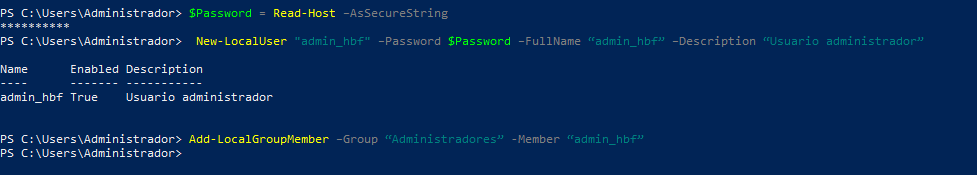

Para comprobarlo, haremos clic derecho en el **menú de inicio** y clicamos en `Administración de equipos`. Dentro, iremos al apartado de `Usuarios y grupos locales > Usuarios`. Hacemos doble clic en el usuario que hemos creado y vamos al apartado `Miembro de` para ver los grupos a los que pertenece.

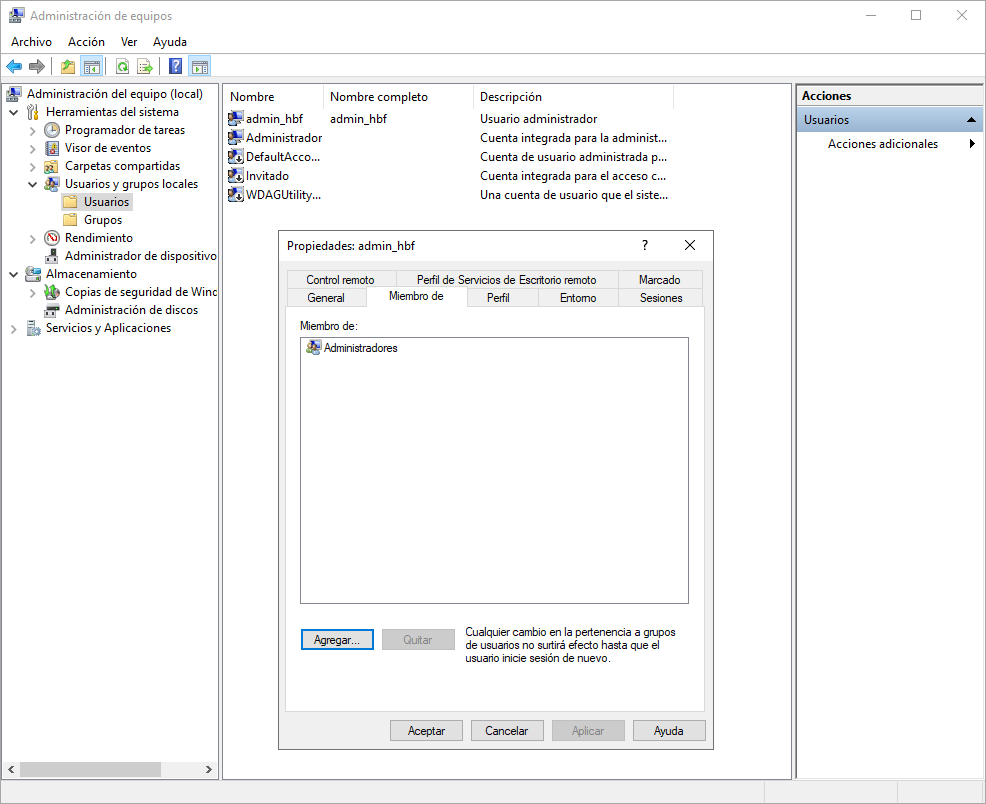

Tenemos que habilitar la administración remota en las tres máquinas. Para ello, pondremos el siguiente comando:
```powershell
Enable-PSRemoting -Force
```

Ahora, utilizaremos el siguiente comando para tener en la lista de TrustedHosts nuestros dos servidores:
```powershell
set-Item WSMan:\localhost\CLient\TrustedHosts -Value "192.168.56.11, 192.168.56.12"       # Tecleamos "S" para aceptar

# Para ver la lista de TrustedHosts
winrm get winrm/config/client
```

> En la versión GUI, hay que ejecutarlos como administrador.

- HBF-2019

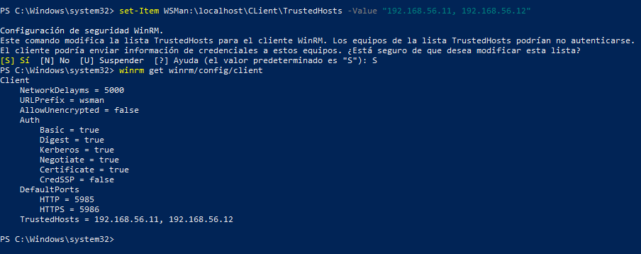

- HBF-CORE-2019


- HBF-CORE2-2019

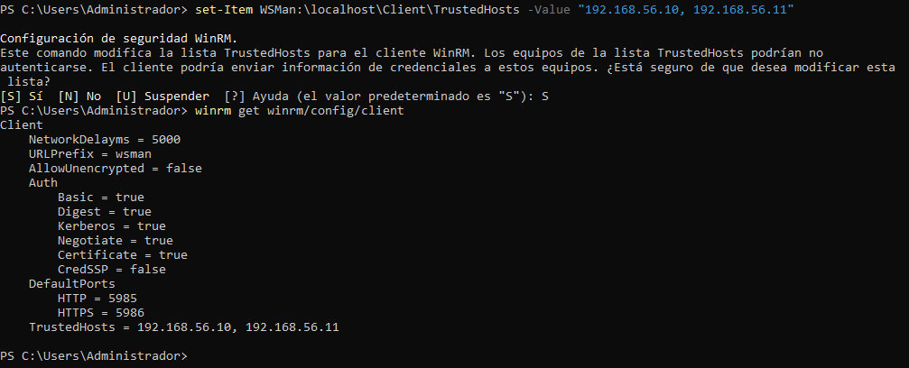


Para poder acceder de manera remota con todos los permisos, tendremos que poner el siguiente comando en los dos servidores **CORE**:
```powershell
New-ItemProperty -Path HKLM:\SOFTWARE\Microsoft\Windows\CurrentVersion\Policies\System -Name LocalAccountTokenFilterPolicy -Value 1 -Force
```

Después, en Windows Server con entorno gráfico, pondremos el siguiente comando para poder poner comandos de manera remota:
```powershell
Invoke-Command -ComputerName 192.168.56.11 -Credential (Get-Credential) -ScriptBlock {Get-Content env:computername}
```

Al poner el comando, nos pedirán credenciales, tendremos que poner la información del servidor al que nos queramos conectar.

Cuando hayamos puesto las credenciales, veremos después el nombre de la máquina al final.

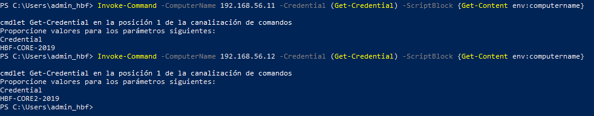

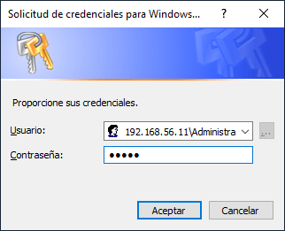

Y para poder acceder en remoto, pondremos el siguiente comando:
```powershell
Enter-PSSession -ComputerName 192.168.56.11 -Credential (Get-Credential)
```

Pedirá también las credenciales del servidor a conectar como en el comando anterior, en la captura podremos ver que se ha accedido a los dos servidores y que se ha podido poner un comando.

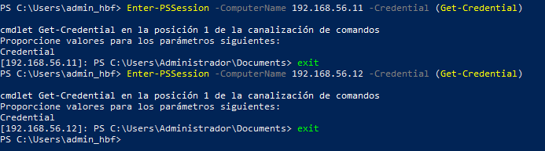

## 4. Configuración del acceso remoto sobre HTTPS
Creamos un certificado automático en los dos servidores Core con el siguiente comando:
```powershell
New-SelfSignedCertificate -DnsName "192.168.56.11" -CertStoreLocation Cert:\LocalMachine\My -KeyLength 2048
```

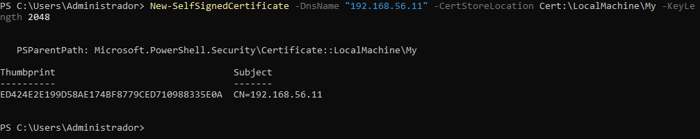

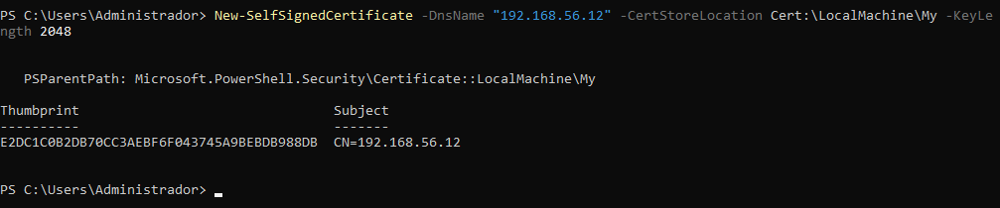

Ahora, eliminamos el Listener de WinRM para HTTP aunque este paso sea opcional, es recomandable hacerlo. Pondremos el siguiente comando también en los dos servidores **CORE**:
```powershell
Remove-Item -Path WSMan:\localhost\Listener\Listener* -Recurse
```

Después, crearemos el nuevo Listener para HTTPS. Usaremos el siguiente comando para verificar el hash del certificado que hemos creado anteriormente.
```powershell
Get-ChildItem -Path Cert:\LocalMachine\My
```

Creamos el nuevo listener con el siguiente comando:
```powershell
New-Item -Path WSMan:\localhost\Listener -Transport HTTPS -Address * -CertificateThumbPrint <hash>

# Tecleamos "S" para continuar
```

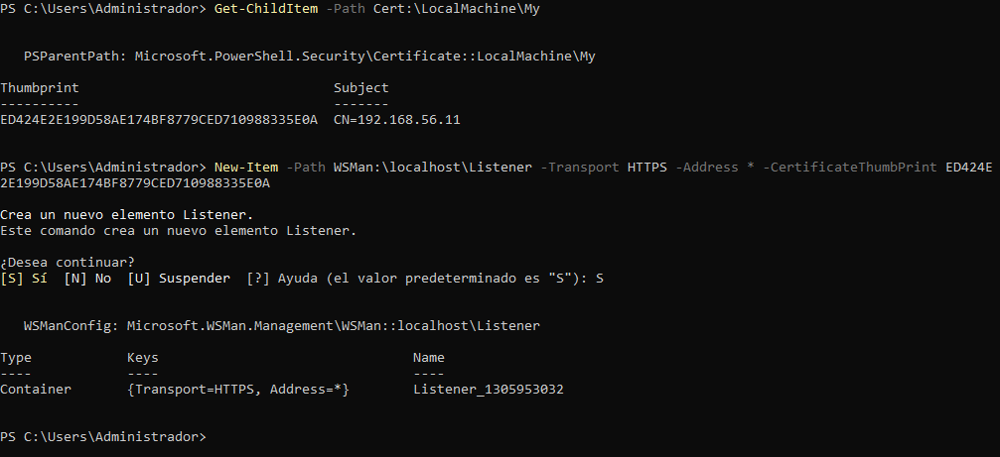

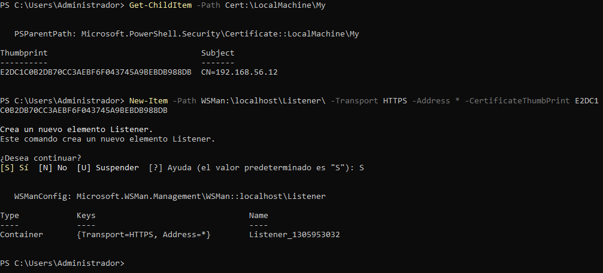

Crearemos una regla en el Firewall para que el puerto **5986** esté abierto al Firewall:
```powershell
netsh advfirewall firewall add rule name="WinRM HTTPS" protocol=TCP dir=in localport=5985 action=allow
```

Al final del comando tiene que salir un mensaje que dice `Aceptar`.

Ahora, para comprobarlo, pondremos el siguiente comando:
```powershell
winrm enumerate winrm/config/Listener
```


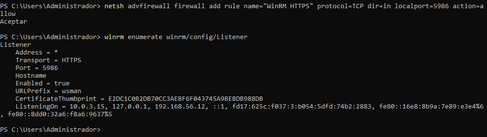

Volvemos a nuestro Windows Server con interfaz gráfica y pondremos el siguiente comando para realizar la comprobación en la que tiene que salir error:
```powershell
Invoke-Command -ComputerName 192.168.56.11 -Credential (Get-Credential) -ScriptBlock {Get-Content env:computername} -UseSSL
```

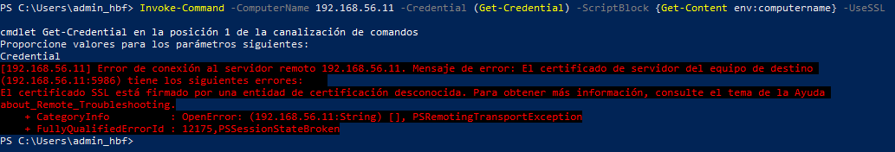

Este error se debe a que el certificado es autofirmado y que el servidor al que nos queremos conectar no lo reconoce y deniega la conexión. Para hacer que lo reconozca, exportaremos el certificado del servidor **CORE** hacia la máquina con entorno gráfico que es con la que estamos realizando las pruebas.  
Para ello, pondremos el siguiente comando para exportarlo:
```powershell
Export-Certificate -Cert Cert:\LocalMachine\My\<hash> -FilePath C:\servercert.cer
```

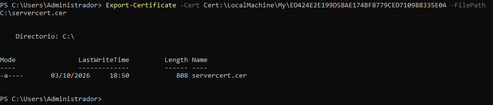

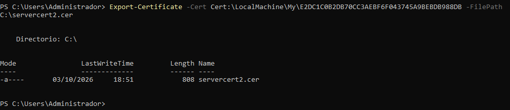

En Windows Server con entorno gráfico, crearemos una carpeta compartida, en mi caso la he creado en `C:\compartida`.

Tenemos que configurar la carpeta para poder compartir los recursos y evitar errores. En mi caso, he hecho todas las configuraciones de las imagenes.

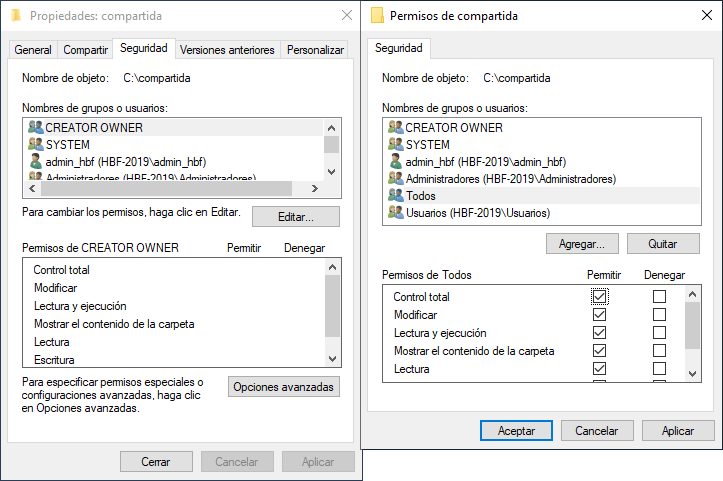

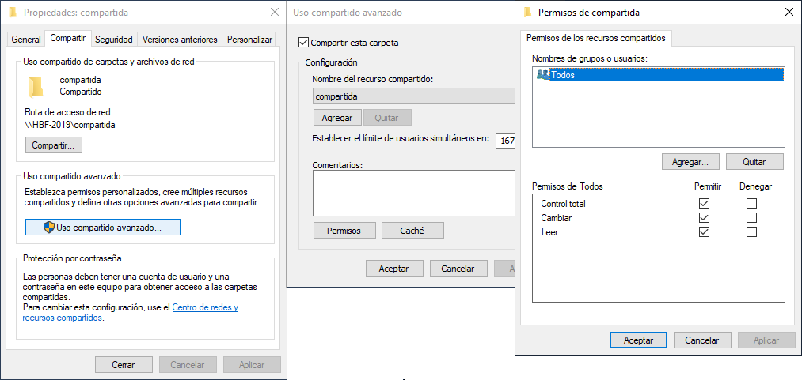

Ahora, movemos el certificado con el siguiente comando:
```powershell
Copy-Item -Path C:\servercert.cer -Destination "\\192.168.56.10\compartida"
```

En Windows Server con entorno gráfico, nos moveremos al directorio de la carpeta compartida y pondremos el comando `dir` y veremos los certificados.

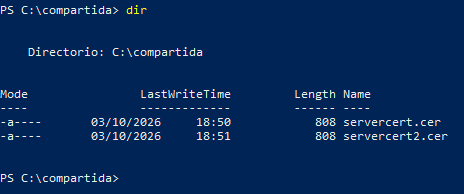

Importamos los certificados con el siguiente comando como administrador:
```powershell
Import-Certificate -FilePath C:\compartida\servercert.cer -CertStoreLocation Cert:\LocalMachine\Root
```

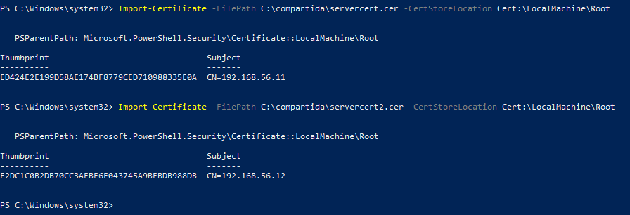

Para comprobarlo, podemos pulsar las teclas Win+R y escribir `certmgr.msc` y ir hacia `Entidades de certificación raíz de confianza > Certificados`.

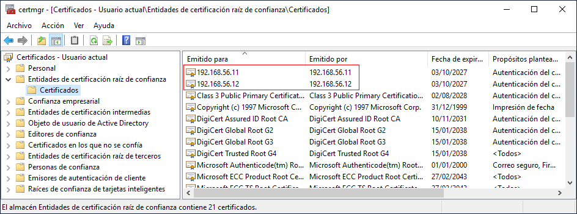

Ahora volvemos a poner el comando para volver a comprobar la conexión:
```powershell
Invoke-Command -ComputerName 192.168.56.11 -Credential (Get-Credential) -ScriptBlock {Get-Content env:computername} -UseSSL
```

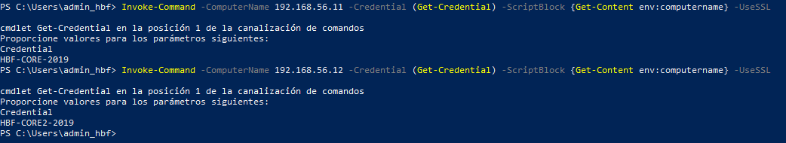

## 5. Configuración remota con Windows Admin Center
A partir de ahora, trabajaremos con el servidor de entorno gráfico.

Descargamos **Windows Admin Center** desde la página oficial:  
[https://www.microsoft.com/es-es/windows-server/windows-admin-center](https://www.microsoft.com/es-es/windows-server/windows-admin-center)

Pero antes, tenemos que deshabilitar la **Configuración de seguridad mejorada de IE**. Para ello, desde el Administrador del servidor vamos a Servidor local y buscamos el apartado mencionado, veremos que está activado, clicamos y seleccionamos todo en **Desactivado**.

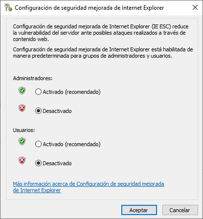

Reiniciamos el servidor y veremos que ya está desactivado. Ahora ya podremos descargar **Windows Admin Center**. Una vez descargado, haremos los pasos de las imagenes:

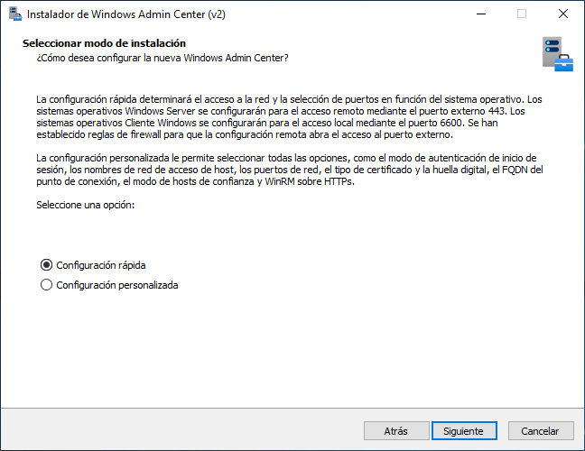

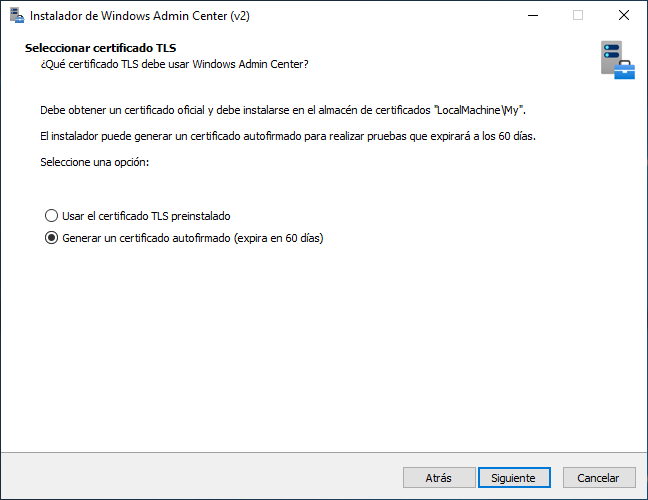

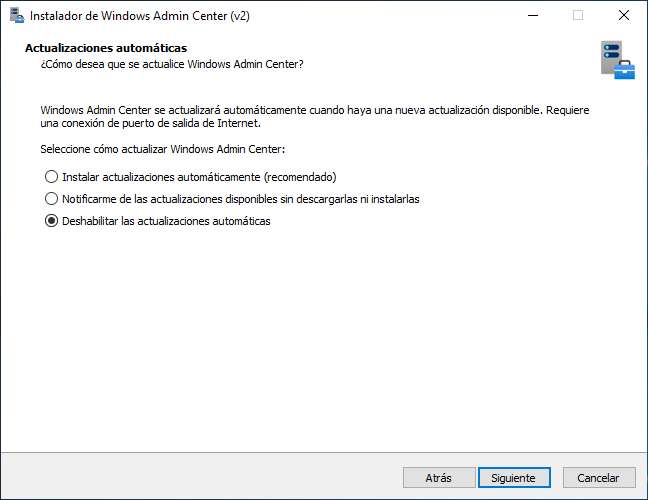

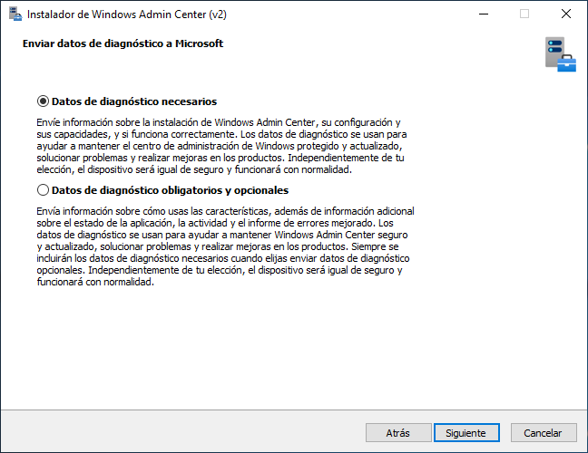

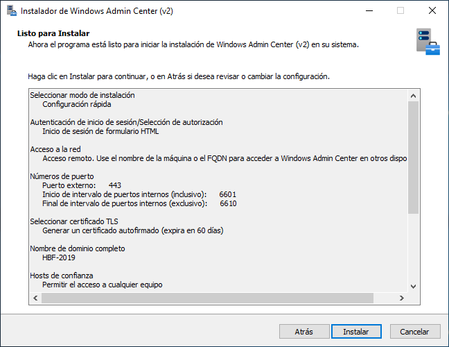

Veremos al final de la instalación, que Windows Admin Center va a utilizar el puerto **433**. Vamos al navegador y pondremos lo siguiente: `https://hbf-2019/` y veremos el mensaje de que esa página no es segura. Clicamos en `Más información` y luego a `Continuar en la página web (no recomendado)`.

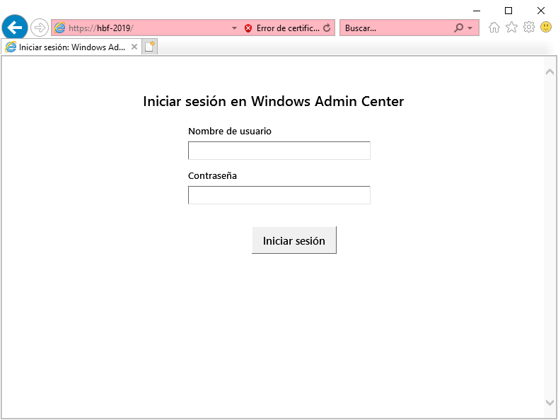

Si vemos esta página, es que se ha instalado correctamente.


[Volver a UT02](../index.md)