# PR0202: El protocolo SSH

## Entorno de trabajo
Necesitaremos tres máquinas virtuales cuyos nombres de usuario, hostname e ip's serán las siguientes:

|Nombre máquina|Nombre usuario|Adaptador 1         |Adaptador 2     |Adaptador 3    |Adaptador 4|
|:------------:|:------------:|:------------------:|:--------------:|:-------------:|:---------:|
|SERVER-A      |hector        |solo anfitrión      |10.20.0.1/16    |10.30.0.1/16   |NAT        |
|SERVER-B      |sysadmin      |10.20.0.10/16       |NAT             |Ø              |Ø          |
|SERVER-C      |sysadmin      |10.30.0.10/16       |NAT             |Ø              |Ø          |

Nuestra máquina **SERVER-A**, tendrá cuatro adaptadores de red, las tres primeras en `sólo anfitrión` para la conexión entre las máquinas y la cuarta la dejamos en `NAT` para tener la salida a Internet. Mientras que las otras dos máquinas, tienen dos adaptadores, el primero en `sólo anfitrión` para la conexión entre las máquinas y el segundo en `NAT` para la salida a Internet.

## Configuración de la red
Editamos el archivo de configuración de las máquinas con el siguiente comando:
```bash
sudo nano /etc/netplan/00-installer-config.yaml
```

Tendremos que tener estas configuraciones para las máquinas:
- `SERVER-A`

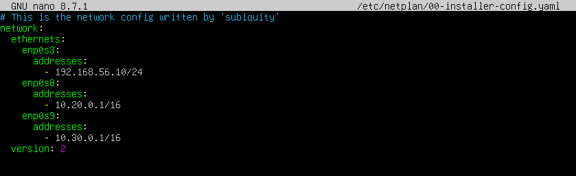

- `SERVER-B`

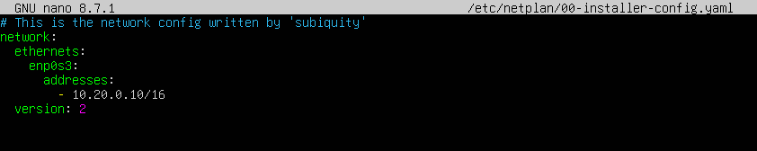

- `SERVER-C`

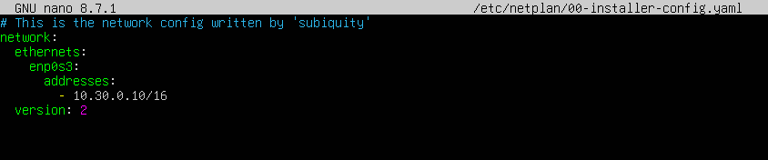

En el primer adaptador de **SERVER-A**, nos servirá para conectarnos por **SSH** desde nuestra máquina anfitriona. En este caso, la conexión con la máquina será la siguiente:
```powershell
ssh hector@192.168.56.10
```

> En caso de que no hayamos sido capaz de acceder, tendremos que poner el comando `sudo ufw enable` para habilitar el firewall.

Ahora veremos que estamos dentro de la máquina virtual desde nuestra máquina anfitriona.  
A partir de ahora, trabajaremos desde la anfitriona con la máquina **SERVER-A**.

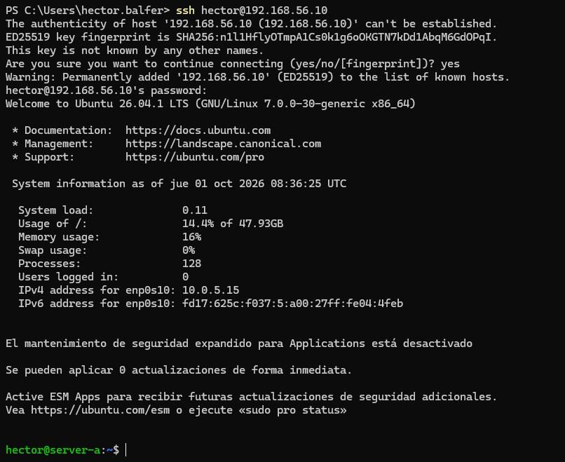

Ahora con los adaptadores de red configurados, haremos `ping` entre las máquinas y veremos lo que ocurre.
- `SERVER-A`

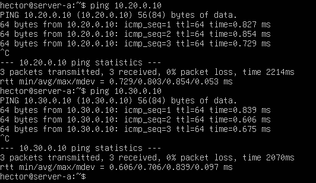

- `SERVER-B`

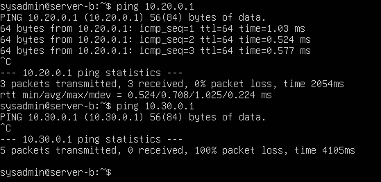

- `SERVER-C`

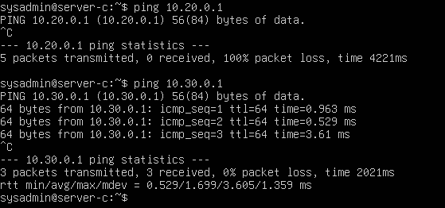

Vemos que **SERVER-B** no puede hacer ping hacia la IP `10.30.x.x` porque no pertenece al rango, al igual que **SERVER-C** con la IP `10.20.x.x`.

## Creación y configuración de las claves

- `SERVER-A`

Creamos la clave con el siguiente comando:
```bash
ssh-keygen -b 1024
```

Al crearla, nos preguntará dónde queremos almacenarla, pulsamos Enter para que utilice la ruta por defecto que es `/home/usuario/.ssh` y ahí se almacenarán tanto la clave privada como la pública.  
Después, para ver el contenido de la clave pública, pondremos el siguiente comando:
```bash
cat .ssh/id_ed25519.pub
```

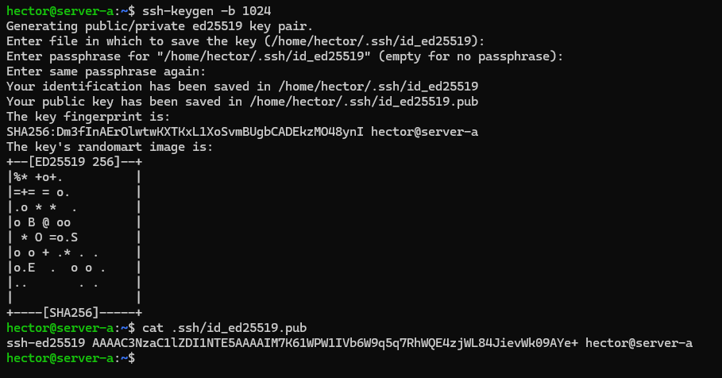

Ahora, pasaremos esa clave pública hacia **SERVER-B** y **SERVER-C**. Para ello, pondremos el siguiente comando:
```bash
scp .ssh/id_ed25519.pub sysadmin@10.20.0.10:~       # SERVER-B
scp .ssh/id_ed25519.pub sysadmin@10.30.0.10:~       # SERVER-C
```

Pedirá de que si estamos seguros de hacerlo y después nos pedirá la contraseña de dicha máquina.

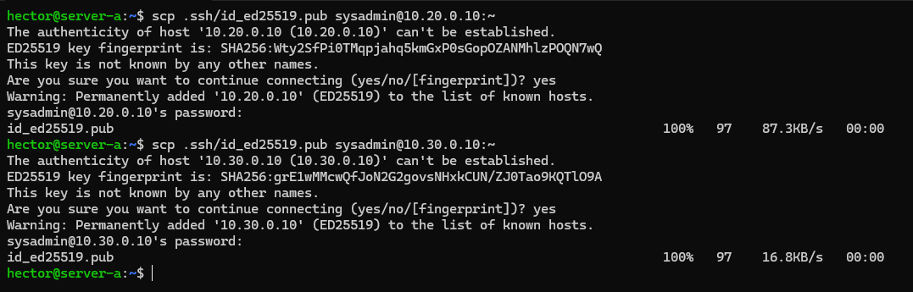

Una vez pasada la clave, nos conectaremos por SSH desde **SERVER-A** hacia **SERVER-B**, todo directamente desde nuestra máquina anfitriona. Pedirá la contraseña de **SERVER-B**. Haremos lo mismo hacia **SERVER-C** para comprobar que podemos conectarnos a ambas máquinas desde `SSH`.

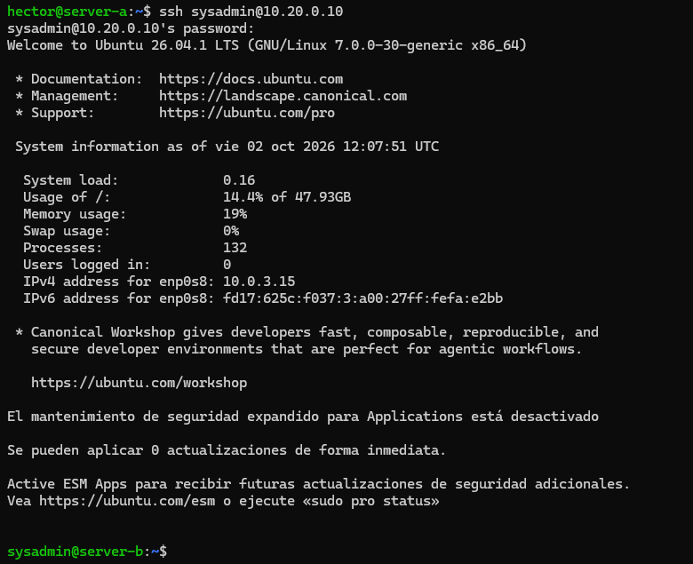

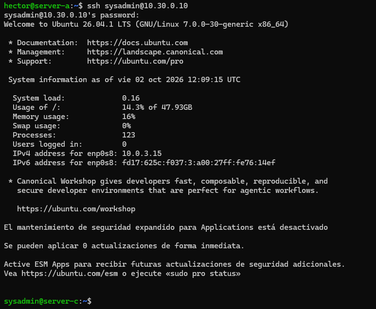

- `SERVER-B` y `SERVER-C`

Como serán los mismos pasos para los dos servidores, se harán en un mismo apartado y utilizaré **SERVER-B** para las capturas.

Movemos la clave recién copiada hacia el directorio, utilizaremos el siguiente comando:
```bash
cat id_ed25519.pub >> .ssh/authorized_keys
```

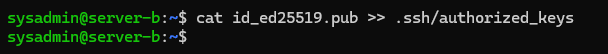

Salimos hacia **SERVER-A** y volvemos a comprobar la conexión. Veremos que ahora no pedirá la contraseña.

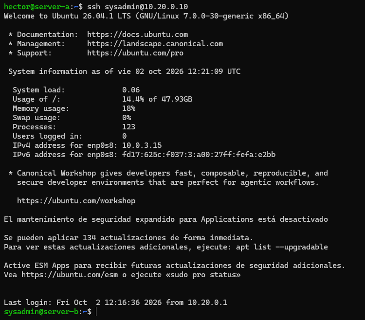

Podemos observarlo que no pone la línea que pide la contraseña.

Haremos los mismos pasos para **SERVER-C**.

## Preguntas a responder
- `~/.ssh/id_rsa`: Contiene la clave privada del usuario.
- `~/.ssh/id_rsa.pub`: Contiene la clave pública del usuario.

Se generan con el comando `ssh-keygen` para configurar el acceso SSH mediante clave pública, iniciando sesión en el servidor de manera remota sin tener que escribir contraseñas.
- `~/.ssh/authorized_keys`: Contiene la lista de las claves públicas de los clientes a los que se les permite el acceso.

Almacena las claves públicas autorizadas en el servidor para que se verifique la identidad del cliente y permita el acceso sin necesidad de poner la contraseña.
- `~/.ssh/known_hosts`: Contiene el registro de las claves de host y los identificadores de los servidores remotos a los que el cliente se ha conectado.

Guarda la huella del servidor para validar su autenticidad en futuras conexiones.
- `/etc/ssh/sshd_config`: Contiene todas las directivas y parámetros de configuración del demonio del servidor SSH ubicado en `/etc/ssh/`.

Configura el comportamiento y la seguridad del servidor SSH. Permite ajustar opciones como:  
-`Port`: Cambia el puerto de escucha (por defecto 22).  
-`ListenAddress`: Especifica la interfaz de red por la que responderá.  
-`PermitRootLogin`: Permite o deniega el acceso remoto al usuario root.  
-`PasswordAuthentication`: Habilita o deshabilita el inicio de sesión por contraseña.  
-`AllowUser` / `DenyUsers`: Listas de usuarios permitidos o denegados.  
-`X11Forwarding`: Habilita la ejecución remota de programas con entorno gráfico.  
-`ChrootDirectory`: Define una jaula chroot para restringir el acceso del usuario a un directorio concreto.
- `/var/log/auth.log`: Contiene el historial de los eventos y registros del sistema sobre las autenticaciones y accesos de los usuarios.

Registra y audita los intentos de conexión al servidor SSH.
- `/etc/hosts.allow`: Contiene la lista de las direcciones IP, nombres de host o subredes que tienen permisos explícitos para conectar con los servicios del sistema.
- `/etc/hosts/deny`: Contiene la lista de las direcciones IP, nombres de host o subredes cuya conexión es bloqueada o denegada.

Ambos controlan y flitran qué equipos de la red pueden o no establecer la conexión con el servicio SSH del servidor antes de llegar a la fase de autenticación.


[Volver a la página anterior](../index.md)