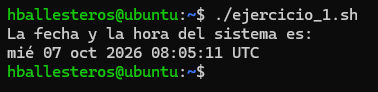
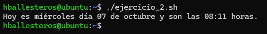
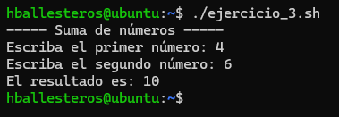

# PR0301: Primeros scripts en Bash

**1.** Crea un script que muestre por pantalla la fecha y la hora del sistema.

Script:
```bash
#!/bin/bash

echo "La fecha y la hora del sistema es:"
date
```

Resultado:



**2.** Mejora el script anterior para que muestre un mensaje de la forma: *“Hoy es jueves día 15 de abril y son las 12:00 horas”*.

Script:
```bash
#!/bin/bash

dia_semana=$(date +"%A")        # %A - Nombre completo del día
dia_mes=$(date +"%d")           # %d - Día del mes en número
mes=$(date +"%B")               # %B - Nombre completo del mes
hora=$(date +"%R")              # %R - Formato de hora en 24h

echo "Hoy es $dia_semana día $dia_mes de $mes y son las $hora horas."
```

Resultado:



**3.** Crea un script que solicite la usuario dos números y luego imprima la suma de esos números.

Script:
```bash
#!/bin/bash

echo "----- Suma de números -----"
read -p "Escriba el primer número: " num1
read -p "Escriba el segundo número: " num2

resultado=$((num1 + num2))

echo "El resultado es: $resultado"
```

Resultado:



**4.** Crea un script que determine si un número introducido por el usuario es par o impar.

Script:
```bash

```

Resultado:


**5.** Escribe un script que solicite el nombre de un archivo y luego imprima cuántas líneas tiene ese archivo. Verifica que el archivo exista antes de contar las líneas.

Script:
```bash

```

Resultado:


**6.** Escribe un script que imprima la tabla de multiplicar de un número introducido por el usuario.

Script:
```bash

```

Resultado:


**7.** Crea un script que solicite el nombre de un archivo y luego informe si el archivo tiene permisos de lectura, escritura y ejecución para el usuario actual.

Script:
```bash

```

Resultado:


**8.** Escribe un script que copie todos los archivos con una extensión específica desde un directorio de origen a uno de destino.

Script:
```bash

```

Resultado:


**9.** Escribe un script que cuente cuántas palabras hay en un archivo y las muestre en la terminal.

Script:
```bash

```

Resultado:


**10.** Crea un script que comprima todos los ficheros del directorio Escritorio que está dentro del directorio personal del usuario actual en un fichero llamado backup.DDMM.gz donde DD es el día del mes y MM el mes. Para comprimir puedes utilizar el comando tar de la siguiente manera:
```bash
tar -zcvf nombre-archivo.tar.gz nombre-directorio
```

Script:
```bash

```

Resultado:


[Volver a la página anterior](../index.md)